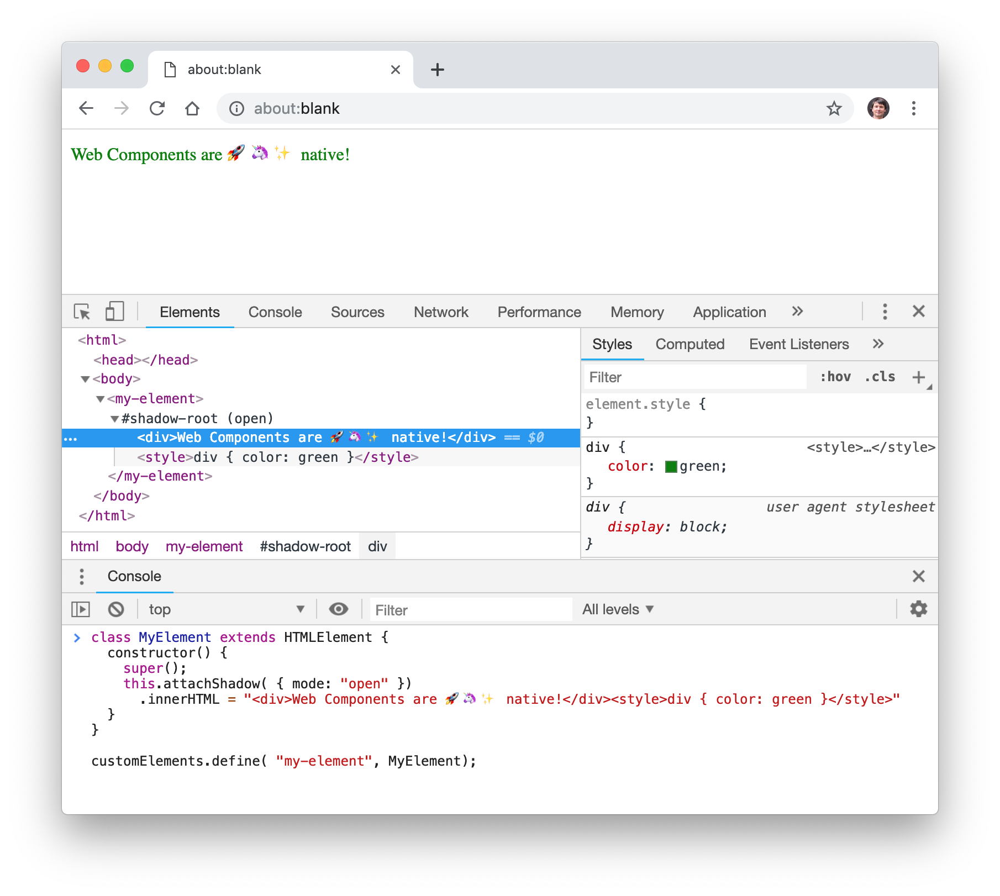
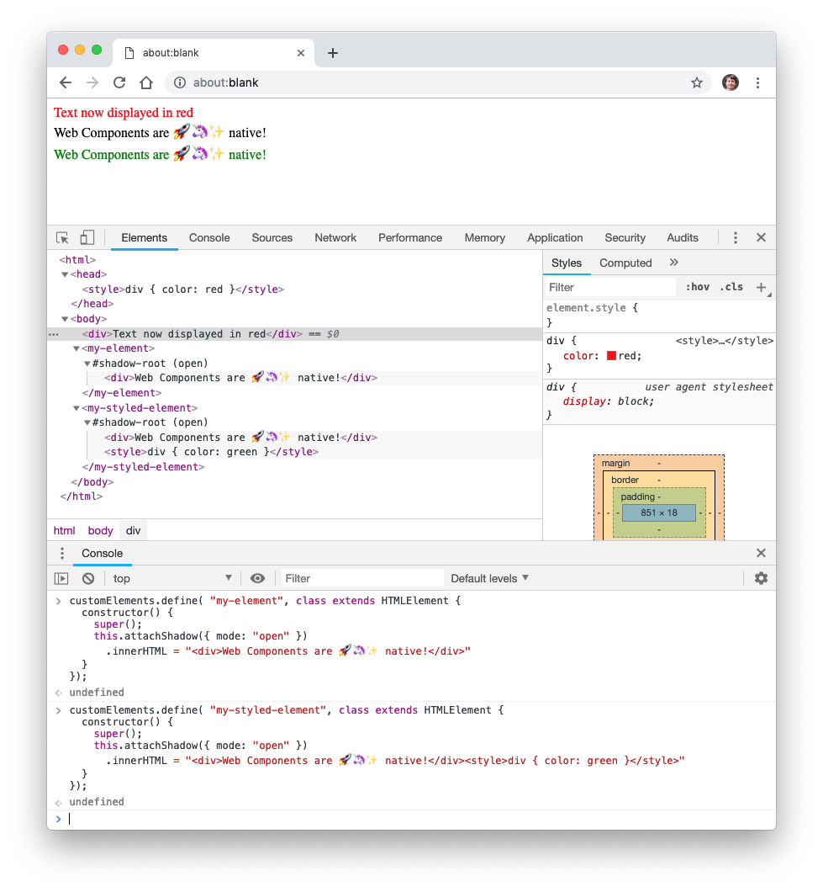

# Example of custom element, live in the browser console

Open [about:blank](about:blank) browser window, then the console and elements views of developer tools (CMD-ALT-I).



Observe that no library is needed, no compilation step — the definition and upgrade of the custom element are immediate.

## In the DOM inspector

The tag ‹my-element› is first unknown to the browser — it will just get ignored.

```
<html>
<head></head>
<body>
  <my-element></my-element>
</body>
</html>
```

## In the Javascript Console

### 1. ‹my-element› displays a simple text

Enter following definition, which will upgrade the previously unknown ‹my-element› tag instance, and display a text.

```
customElements.define( "my-element", class extends HTMLElement {
  constructor() {
    super();
    this.attachShadow({ mode: "open" })
      .innerHTML = "<div>Web Components are 🚀🦄✨ native!</div>"
  }
});
```

### 2. ‹my-styled-element› has additional styling

Add an additional element definition, with a Shadow DOM containing some CSS styling.

```
customElements.define( "my-styled-element", class extends HTMLElement {
  constructor() {
    super();
    this.attachShadow({ mode: "open" })
      .innerHTML = "<div>Web Components are 🚀🦄✨ native!</div><style>div { color: green }</style>"
  }
});
```

And add it to the DOM; you'll see it be rendered in green. Nothing special so far, however note that the style belongs to the Shadow DOM.

```
<html>
<head></head>
<body>
  <my-element></my-element>
  <my-styled-element></my-styled-element>
</body>
</html>
```

### 3. Styles defined in the Shadow DOM have no effect outside

```
<html>
<head>
</head>
<body>
  <div>Text displayed in black</div>
  <my-element></my-element>
  <my-styled-element></my-styled-element>
</body>
</html>
```

### 4. And vice-versa — styles defined in the DOM have no effect on the Shadow DOM

To the exception of CSS properties that are inherited — such as font styles — these would affect the Shadow DOM.

In the following example, observe that the outer ‹div› element appears styled in red, but not the ‹div› element inside the _Shadow DOM_ of ‹my-element›.

```
<html>
<head>
  <style>div { color: red }</style>
</head>
<body>
  <div>Text now displayed in red</div>
  <my-element></my-element>
  <my-styled-element></my-styled-element>
</body>
</html>
```



## Source

Inspired by the example presented by [Kevin P. Schaaf](https://twitter.com/kevinpschaaf) at min. 18:35 of collective talk [« Future, Faster: Unlock the Power of Web Components with Polymer (Google I/O '17) »](https://www.youtube.com/watch?v=cuoZenpQveQ&feature=youtu.be&t=1044).