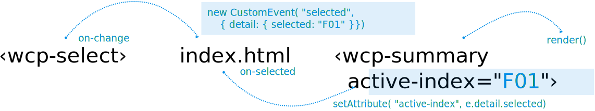

[« prev](../02-wcp-summary-step03/) [next »](../02-wcp-summary-step05/)

# 4. Dataflow – Vanilla data-bindings

Part of the live-coding examples of the talk [A Primer to Web Components](https://web-components-primer.firebaseapp.com).

---



## Data-in via attribute, data-out via custom event

**Data-out** – when you pick an item from the `‹wcp-select›` element, it will dispatch an `on-change` custom event, with the identifier of the selected item in its detail.

**Data-binding** — the listener on this enclosing HTML page will respond to the `on-change` custom event, retrieve the identifier of the selected item and set it as the value of the `active-index` attribute of the `‹wcp-select›` element.

**Data-in** — The `‹wcp-summary›` element is observing its `active-index` attribute and will use the new value to highlight the selected summary item.

## Custom event handler declaration on ‹wcp-select›

The `@change=${this.onSelected}` shorthand notation asks Lit-Element
to register the `onSelected()` method of the WCPSummarySelect class
as an event handler of the `change` event. The `change` event fires
for the `‹select›` HTML element, when the user selects a new option.

When the `onSelected()` event handler is called, note it was bound
to the class instance by Lit-Element previously – so the `this`
keyword, used  inside that method, correctly refers to the custom
element class instance, as you would expect. Lit-Element takes that
step for us; otherwise you would have the `this` keyword referring
to the dispatched event target — that is, the `select` HTML element.

In summary, with the `@change=${this.onSelected}` syntax, Lit-Element
does the following for us:

```
  firstUpdated() {
    this.shadowRoot.querySelector( "select")
      .addEventListener( "change", this.onSelected.bind( this));

  }
```

Isn't it neat? Less code to write. `@change=${this.onSelected}` is
concise and avoids the idiosynchrasy of Javascript's event scope.

---

[View it on Glitch](https://wcp-summary-step04.glitch.me/) /
[Remix it on Glitch](https://glitch.com/edit/#!/wcp-summary-step04)