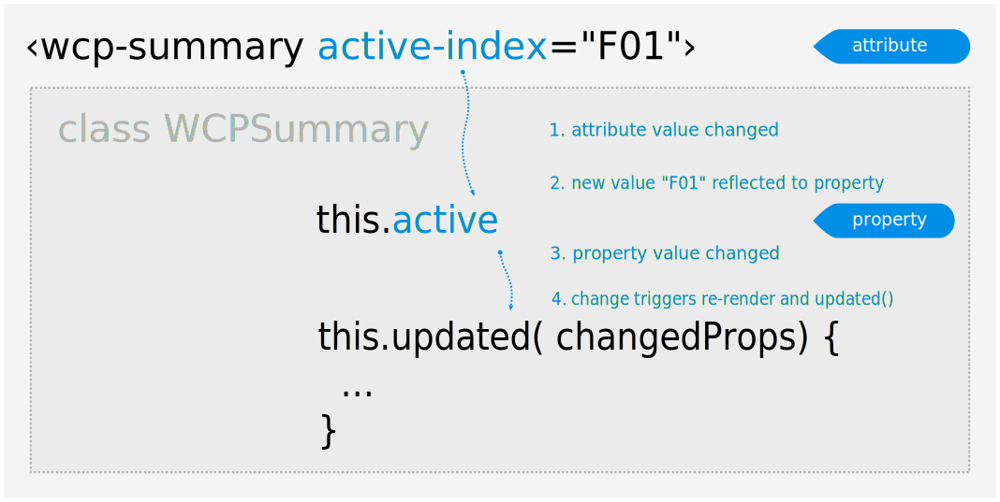

[« prev](https://glitch.com/edit/#!/wcp-summary-step02?path=README.md) [next »](https://glitch.com/edit/#!/wcp-summary-step04?path=README.md)

# 3. Using Web Components – Lit-Element Data-bindings

---

Part of the live-coding examples of the talk [A Primer to Web Components](https://web-components-primer.firebaseapp.com).

---

## Essentially, this example shows

* Observed attribute and bound property
  * Definition of an observed attribute and property
  * Automatic attribute to property reflection
  * Reacting to a change of the property value
  * Property to attribute reflection
* Declaration of an event handler



## While live-coding, we would have said…

### …about observed attributes and properties of ‹wcp-summary›

We defined a new **`active-index`** _attribute_ on our **‹wcp-summary›**
element. And the attribute will automatically be bound by Lit-Element
to the **`active`** _property_ of the WCPSummary class instance.

Both `active-index` attribute and `active` property are being declared
to Lit-Element, by a static `properties()` getter; Lit-Element will
register their type and consequently observe changes for both
_attribute_ and _property_:

1. Changes to the `active-index` _attribute_ will be automatically
propagated to the `active` _property_ by Lit-Element; they are said
to be bound to each other. Once the `active` property was updated,
the HTML template that is defined by `render()` gets re-rendered.
2. Changes to the `active` _property_ are reflected to the `active-index`
_attribute_ — by a setter automatically defined by Lit-Element.

We also observe these changes, in logic we defined:

In the `updated()` method, we defined logic to respond to a change
to the `active` property's value: when it receives a new value —
which is supposed to be the id of one of the ‹h1› or ‹li› items
of the summary —, it will add an `active` attribute to that
identified ‹h1› or ‹li› item.

The call to the `updated()` method is part of Lit-Element's
lifecycle: Lit-Element will call it with the list of properties
that changed, after it observed one or more change to the values
of properties, and after the template was newly rendered.

A change to the `active-index` _attribute_ would usually come from
the « outside world » of the element — that is, logic from the DOM
around it. You can consider attributes being observed as « the
API » of a Web Component. Whereas changes to the values of observed _properties_ would usually come from the custom element itself.

Yet there are cases where you would also consider some _property_
as part of « the API » of a Web Component. _Attribute_ value indeed
need to    be parsed and converted to _property_ values — which comes
at a  cost, for big datastructures, such as tables or complex objects.
You'll see such a case in [step 5](https://glitch.com/edit/#!/wcp-summary-step05?path=README.md) of this live-coding example.

There would be much more to say about bindings between attributes
of an element and the properties of its class instance; a glimpse:

* you can define a _property_ as being observed by Lit-Element, without
  being bound to an _attribute_ (`{ type: …, attribute: false }`);
* you can decide that changes to observed _properties_ are being
  **reflected** to the _attribute_ they're bound to
  (`{ type: …, reflect: true }`) – or not, in which case the attribute
  always keeps the value that is defined in the DOM; while the property
  holds a different updated value.

### … about the event handler of of ‹wcp-select›

The `@change=${this.onSelected}` shorthand notation asks Lit-Element
to register the `onSelected()` method of the WCPSummarySelect class
as an event handler of the `change` event. The `change` event fires
for the `‹select›` HTML element, when the user selects a new option.

When the `onSelected()` event handler is called, note it was bound
to the class instance by Lit-Element previously – so the `this`
keyword, used  inside that method, correctly refers to the custom
element class instance, as you would expect. Lit-Element takes that
step for us; otherwise you would have the `this` keyword referring
to the dispatched event target — that is, the `select` HTML element.

In summary, with the `@change=${this.onSelected}` syntax, Lit-Element
does the following for us:

```
  firstUpdated() {
    this.shadowRoot.querySelector( "select")
      .addEventListener( "change", this.onSelected.bind( this));

  }
```

Isn't it neat? Less code to write. `@change=${this.onSelected}` is
concise and avoids the idiosynchrasy of Javascript's event scope.

---

Click `Show` in the header to see this example live. Updates to the code will instantly deploy and update live. Made with [Glitch](https://glitch.com/about).