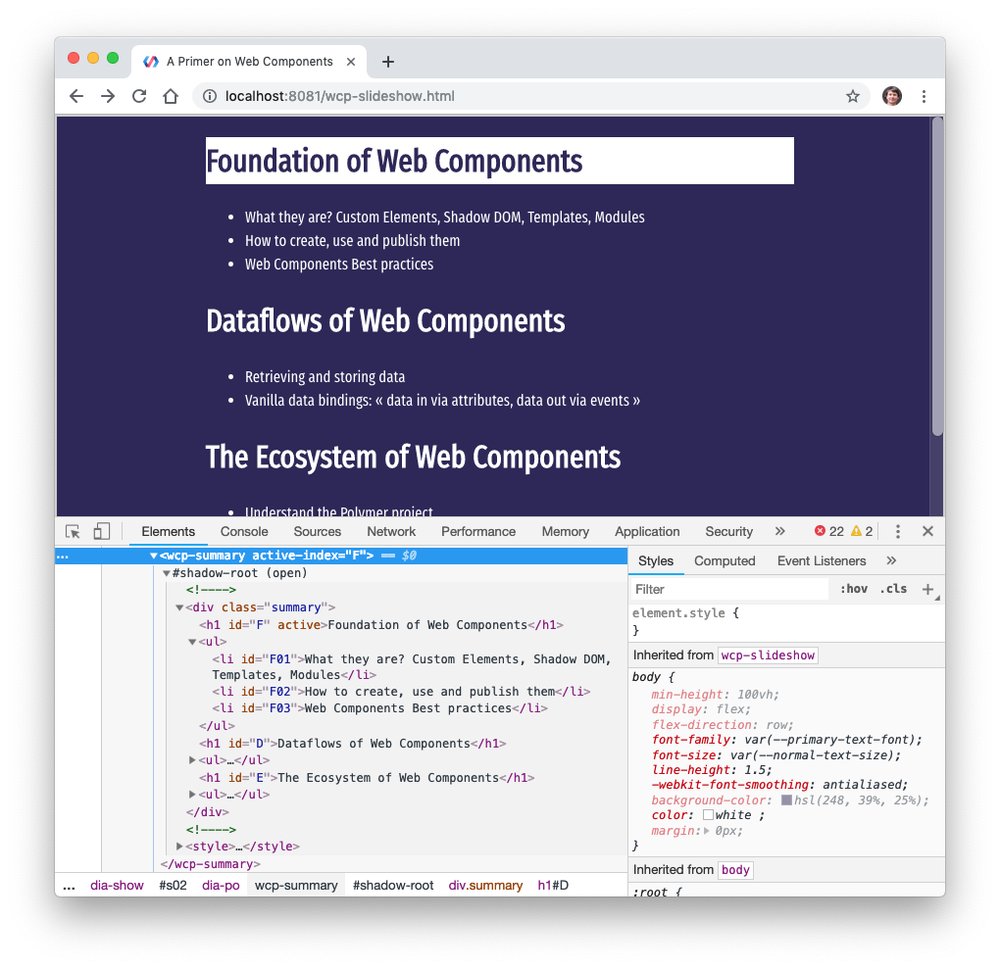

# Live-coding examples

Source code of the examples shown in live-coding parts of the slideshow. Also [available on Glitch](https://glitch.com/@olange/web-components-primer) to view, test, and remix.

* [1. Live Custom Element](01-live-custom-element/) — just in the console, definition and upgrade of a custom element
* [2. Custom Element ‹wcp-summary›](02-wcp-summary-step01/) — complete example of a [`Lit-Element`](https://lit-element.polymer-project.org/)
  * [Step 1. Using Web Components – How to start?](02-wcp-summary-step01/)
  * [Step 2. Using Web Components – Lit-Element Templates](02-wcp-summary-step02/)
  * [Step 3. Using Web Components – Lit-Element Data-bindings](02-wcp-summary-step03/)
  * [Step 4. Dataflow – Vanilla data-bindings](02-wcp-summary-step04/)
  * [Step 5. Dataflow – Fetching data](02-wcp-summary-step05/)

