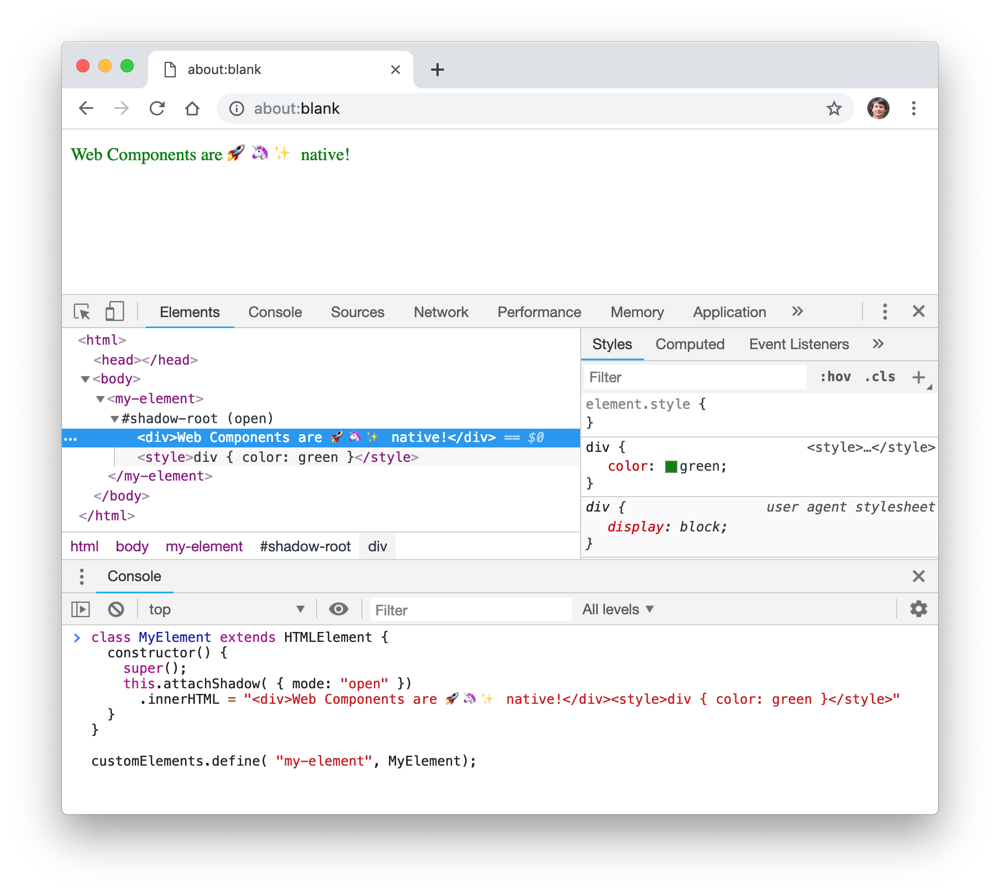

# Example of custom element, live in the browser console

Open [about:blank](about:blank) browser window, then the console and elements views of developer tools (CMD-ALT-I).



Observe that no library is needed, no compilation step — the definition and upgrade of the custom element are immediate.

## Immediate anonymous class

### 1. Just text

```
customElements.define( "my-element", class extends HTMLElement{
  connectedCallback() {
    this.attachShadow( { mode: "open" })
      .innerHTML = "Web Components are 🚀🦄✨ native!"
  }
});
```

### 2. With CSS styling — scoped to the Shadow DOM:

```
customElements.define( "my-element", class extends HTMLElement{
  connectedCallback() {
    this.attachShadow( { mode: "open" })
      .innerHTML = "<div>Web Components are 🚀🦄✨ native!</div><style>div { color: green }</style>"
  }
});
```

## ES6 class definition and constructor

### 1. Just text

```
class MyElement extends HTMLElement {
  constructor() {
    super();
    this.attachShadow( { mode: "open" })
      .innerHTML = "Web Components are 🚀🦄✨ native!"
  }
}

customElements.define( "my-element", MyElement);
```

### 2. With CSS styling — scoped to the Shadow DOM

```
class MyElement extends HTMLElement {
  constructor() {
    super();
    this.attachShadow( { mode: "open" })
      .innerHTML = "<div>Web Components are 🚀🦄✨ native!</div><style>div { color: green }</style>"
  }
}

customElements.define( "my-element", MyElement);
```

## Source

Example presented by Kevin Schaaf at min. 18:35 of collective talk [« Future, Faster: Unlock the Power of Web Components with Polymer (Google I/O '17) »](https://www.youtube.com/watch?v=cuoZenpQveQ&feature=youtu.be&t=1044).