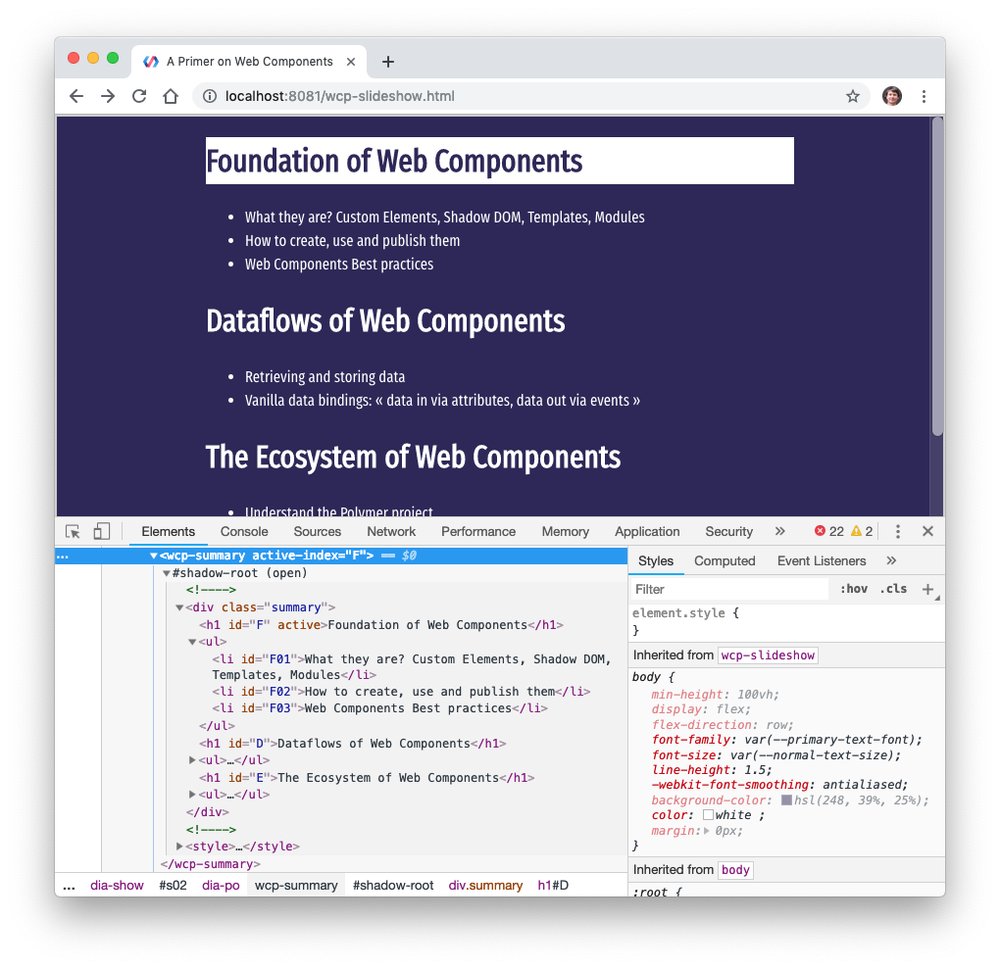

# Example of ‹wcp-summary› element

Complete example of a [`Lit-Element`](https://lit-element.polymer-project.org/), with an [Lit-HTML template](https://lit-html.polymer-project.org/) and a bound attribute.



[View it on Glitch](https://wcp-summary.glitch.me/)  
[Remix it on Glitch](glitch.com/edit/#!/wcp-summary)

## script.js

```
import { LitElement, html } from "lit-element";
import { SummaryStyles } from "./style.js";

export class WCPSummary extends LitElement {

  static get styles() {
    return [ SummaryStyles ];
  }

  static get properties() {
    return {
      active: { type: String, attribute: "active-index", reflect: true }
    };
  }

  constructor() {
    super();
    this.active = undefined;
  }

  updated( changedProperties) {
    if( changedProperties.has( "active")) {
      const oldActive = changedProperties.get( "active");

      // Remove `active` attribute on element that was previously active (if it still exists)
      if( typeof oldActive !== "undefined") {
        const oldActiveElt = this.shadowRoot.getElementById( oldActive);
        if( oldActiveElt) oldActiveElt.removeAttribute( "active"); }

      // Set `active` attribute on element newly identified as being the active one
      const activeElt = this.shadowRoot.getElementById( this.active);
      if( activeElt) activeElt.setAttribute( "active", "");
    }
  }

  render() {
    return html`
      <div class="summary">
        <h1 id="F">Foundation of Web Components</h1>
        <ul>
          <li id="F01">What they are? Custom Elements, Shadow DOM, Templates, Modules</li>
          <li id="F02">How to create, use and publish them</li>
          <li id="F03">Web Components Best practices</li>
        </ul>

        <h1 id="D">Dataflows of Web Components</h1>
        <ul>
          <li id="D01">Retrieving and storing data</li>
          <li id="D02">Vanilla data bindings: « data in via attributes, data out via events »</li>
        </ul>

        <h1 id="E">The Ecosystem of Web Components</h1>
        <ul>
          <li id="E01">Understand the Polymer project</li>
          <li id="E02">Navigate WebComponents.org and discover its main collections</li>
          <li id="E03">Understand Material Design and A11Y</li>
          <li id="E04">Lit-HTML and Lit-Element</li>
        </ul>
      </div>
    `;
  }
}

// Register the element with the browser
customElements.define( "wcp-summary", WCPSummary);
```

## style.css

```
import { css } from "lit-element";

const SummaryStyles = css`
  *[ active] {
    background-color: white;
    color: hsl(248, 39%, 25%) }
  .summary {
    margin: 0 auto; max-width: 600px; }
`;

export {
  SummaryStyles
}
```

## style.css

```
@import url( "https://fonts.googleapis.com/css?family=Fira+Mono|Fira+Sans+Condensed|Fira+Sans+Extra+Condensed");

body {
  margin: 0; min-height: 100vh;
  display: flex; flex-direction: row;
  font-family: "Fira Sans Extra Condensed", sans-serif, "Apple Color Emoji", "Segoe UI Emoji", "Segoe UI Symbol";
  font-size: 16px; line-height: 1.5;
  -webkit-font-smoothing: antialiased;
  background-color: hsl(248, 39%, 25%);
  color: white }

body, wcp-slideshow {
  display: flex; flex-direction: row }

body {
  align-items: center;
  justify-content: center;
  transform: skew( 0, -5deg) }

wcp-slideshow {
  flex-grow: 1 }

h1 {
  font-family: "Fira Sans Condensed", sans-serif }

a { color: white }
a:hover, a:visited { color: lightskyblue }
```

## index.html

```
<!DOCTYPE html>
<html lang="en">
  <head>
    <title>Hello!</title>
    <meta charset="utf-8">
    <meta http-equiv="X-UA-Compatible" content="IE=edge">
    <meta name="viewport" content="width=device-width, initial-scale=1">
    
    <!-- import the webpage's stylesheet -->
    <link rel="stylesheet" href="/style.css">
    
    <!-- import the webpage's javascript file -->
    <script src="/node_modules/@webcomponents/webcomponentsjs/webcomponents-loader.js"></script>
    <script type="module" src="/script.js" defer></script>
  </head>  
  <body>
    <wcp-summary active-index="F" />
  </body>
</html>
```

## package.json

```
{
  "name": "wcp-summary",
  "version": "0.0.1",
  "description": "Web Components Primer Summary · Live Coding",
  "scripts": {
    "start": "polyserve --npm --module-resolution=node"
  },
  "dependencies": {
    "@webcomponents/webcomponentsjs": "^2.2.7",
    "lit-element": "^2.0.1"
  },
  "devDependencies": {
    "polyserve": "^0.27.15"
  },
  "engines": {
    "node": "8.x"
  }
}
```